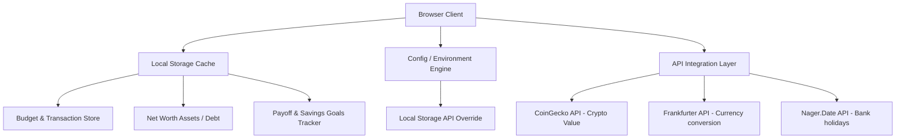

# 💎 SmartBudget — Personal Finance Cockpit

**Developed with ❤️ by Santhakumar K • Alpha X Solutions**

[](https://nextjs.org/)
[](https://www.typescriptlang.org/)
[](https://tailwindcss.com/)
[](https://www.framer.com/motion/)
[](#privacy-first)

SmartBudget is an **enterprise-grade**, privacy-first personal finance dashboard. It combines the strongest ideas of **Zero-Based Budgeting** and the **50/30/20 rule** into a modern, fluid, and premium glassmorphic UI. 

Everything runs completely locally in the browser — no bank logins, no ads, no trackers, and no server roundtrips.

---

## 🗺️ System Architecture



---

## ⚡ Key Highlights & Premium Features

*   🎨 **Sleek Glassmorphic Design**: Frosted glass panels, dynamic micro-interactions, responsive sizing, and vibrant accent colors.
*   🌗 **Fluid Dark/Light/System Mode**: Persisted, transition-buffered color theme toggle via `next-themes` (no flashes).
*   📱 **Adaptive Mobile UI**: Minimalist top-bar, custom bottom tab navigator, and responsive grids designed specifically for mobile use.
*   🔑 **Local API Settings Controller**: Manage API credentials on-the-fly and save them locally inside the browser.
*   📈 **Staggered Animations**: Spring-based navigation indicator, fluid progress bars, and animated count-up numbers using `framer-motion`.
*   🚫 **Privacy-First**: No data leaves your machine. Full data import/export controls are available.

---

## 📦 What's Inside (9 Modules)

| Module | Icon | Features |
| :--- | :---: | :--- |
| **Dashboard** | 📊 | Income anchors, Safe-to-Spend trackers, animated Budget Health Score, category allocations, and bank holidays warnings. |
| **Budget Controller** | 💼 | Custom zero-based or 50/30/20 allocation modes, auto-fill targets, and progress metrics. |
| **Transactions Log** | 📝 | Full CRUD ledger, multi-filter search, CSV export, and recurring automation engines. |
| **Reporting Hub** | 📈 | Six-month income vs. expense comparisons, savings rates, and interactive breakdown charts. |
| **Net Worth Valuator** | 💰 | Asset & debt breakdowns, integrated currency converters, and real-time crypto asset tickers. |
| **Debt Payoff Engine** | 📉 | Avalanches vs. Snowball payoff simulation strategies, visualization timelines, and extra payment controllers. |
| **Savings Goals** | 🎯 | Visual goal contribution charts and progress tracks. |
| **Subscriptions** | 🔄 | Recurring subscriptions ledger with weekly/monthly/yearly aggregators. |
| **Settings Control** | ⚙️ | Securely update API keys (CoinGecko, Frankfurter, Nager) stored strictly inside `localStorage`, and data wipe controls. |

---

## 🔌 API Integrations

SmartBudget utilizes open data APIs which run fully key-free by default. If you require higher rate limits, you can add custom API keys directly inside the in-app **Settings Control Panel**:

1.  **[CoinGecko API](https://www.coingecko.com/en/api)**: Fetch live cryptocurrency token values for Bitcoin, Ethereum, Solana, and more.
2.  **[Frankfurter API](https://frankfurter.dev)**: Fetch live reference exchange rates backed by the European Central Bank (ECB).
3.  **[Nager.Date API](https://date.nager.at)**: Query public/bank holidays dynamically based on selected country codes.

---

## 🛠️ Development Setup

Ensure you have [Node.js](https://nodejs.org/) installed, then follow these steps:

### 1. Install Dependencies
```bash
npm install
```

### 2. Run Development Server
```bash
npm run dev
```
Open [http://localhost:3000](http://localhost:3000) to view your cockpit locally.

### 3. Production Build & Quality Check
Ensure there are no TypeScript compile or lint errors before shipping:
```bash
# Type check code
npx tsc --noEmit

# Lint check code
npm run lint

# Build production bundle
npm run build

# Start production server
npm run start
```

---

## 📁 Folder Structure

```text
src/
├── app/               # Page router endpoints (Dashboard, Budget, Debt, Net Worth, etc.)
├── components/        # Glassmorphic UI layout panels, charts, and dialogs
│   ├── charts/        # Recharts wrappers (Pie, Bar, Area, Line)
│   └── ui/            # UI components (Radix Dialogs, Modals, animated numbers)
└── lib/               # Shared logic libraries (Math engines, storage wrappers, defaults)
```

---

## 🛡️ License

This project is licensed under the MIT License - see the [LICENSE](LICENSE) file for details.

Developed by **Santhakumar K • Alpha X Solutions** (2026).
